<div align="center">


<br/>

[](https://nextjs.org)
[](https://react.dev)
[](https://www.typescriptlang.org)
[](https://www.prisma.io)
[](https://tailwindcss.com)
[](https://ui.shadcn.com)
[](#-testing)
[](#-localization)

**A farm-management system for broiler and layer poultry operations — built for phones in the shed, in your language.**

[Quick start](#-quick-start) · [Features](#-features) · [Screenshots](#-screenshots) · [Architecture](#-architecture) · [Roadmap](#-roadmap)

</div>

---

## ✨ Why PMS

Small and mid-size poultry farms still run on notebooks and memory. PMS replaces that with a system that is **fast to enter data into, impossible to mis-count, and readable by the owner at a glance** — while working on a low-end phone and in Dari or Pashto as naturally as in English.

> Every bird is accounted for: **population is never typed in, it is computed** — `initial − Σ movements` — so the numbers can't drift.

---

## 🐣 From egg to result

<div align="center">
</div>

A batch is tracked from placement to sale. At every stage the system knows exactly how many birds are alive, how much they weigh against the breed standard, how much feed has gone in and — for layers — how many eggs came out. Losses are recorded as movements, never as an overwritten count.

---

## 🚀 Quick start

```bash
git clone https://github.com/hakimiomari/poultry-management-system.git
cd poultry-management-system
npm install          # also runs `prisma generate`
npm run db:reset     # migrate + seed 2 demo flocks with 30 days of records
npm run dev          # → http://localhost:3000
```

<details>
<summary><b>Demo accounts</b> (phone / password)</summary>

| Role | Phone | Password | Language |
|---|---|---|---|
| 👑 Owner | `0700000001` | `owner123` | English |
| 🧑‍💼 Farm manager | `0700000002` | `manager123` | دری |
| 👷 Worker | `0700000003` | `worker123` | پښتو |
| 🩺 Veterinarian | `0700000004` | `vet123` | English |
| 🧾 Accountant | `0700000005` | `acct123` | English |

</details>

---

## 🧩 Features

<table>
<tr>
<td width="50%" valign="top">

### 🐔 Flocks & sheds
- Broiler and layer flocks with breed, intake date, initial weight and cost
- Sheds with capacity — a flock can't be housed where it doesn't fit
- Occupancy bars, status (occupied / empty / cleaning / maintenance)
- Close a flock when the batch ends; its history stays

</td>
<td width="50%" valign="top">

### 📝 Daily logs & movements
- One-screen daily entry: deaths, feed, water, eggs, broken eggs
- Large numeric inputs designed for low-literacy, one-handed use
- Every bird that leaves is a **movement** — mortality, cull, sale, transfer, theft — with cause and weight
- Edit or delete any record; everything is audit-logged

</td>
</tr>
<tr>
<td valign="top">

### 📊 Dashboard & analytics
- Live population, mortality %, deaths today, eggs and feed today
- Population, daily-mortality and hen-day production charts per flock
- Formulas (FCR, hen-day %, water:feed ratio) are pure functions with unit tests

</td>
<td valign="top">

### 🚨 Alerts & rules
- Abnormal mortality (> 1 % of current birds) → **critical**
- Missing daily log after cutoff → reminder
- Thresholds live in a `settings` table — **no hardcoded business numbers**
- Broiler sales require a weight; you can't remove more birds than exist

</td>
</tr>
<tr>
<td valign="top">

### 👥 Users & roles
- Owner, Farm manager, Worker, Veterinarian, Accountant
- Owner manages accounts: create, edit, reset password, deactivate
- Profile page, change-password dialog, account menu in the header

</td>
<td valign="top">

### 🌍 Localization & UX
- **English, Dari and Pashto** — every string, error and enum
- Full **RTL** layout and Arabic-script typography (Vazirmatn)
- Gregorian **and Solar Hijri** dates in the header
- Light and dark themes, mobile bottom navigation

</td>
</tr>
</table>

---

## 📸 Screenshots

<div align="center">

| Dashboard — dark | Dashboard — light |
|:--:|:--:|
| 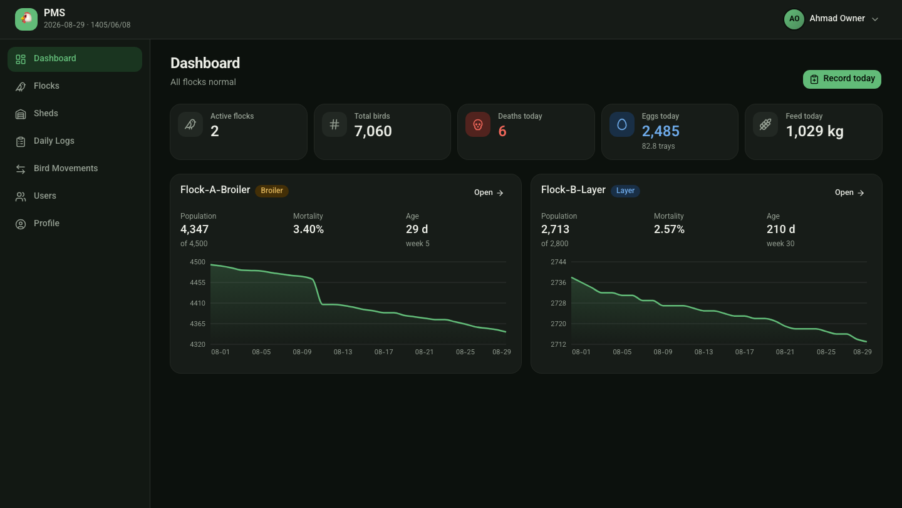 | 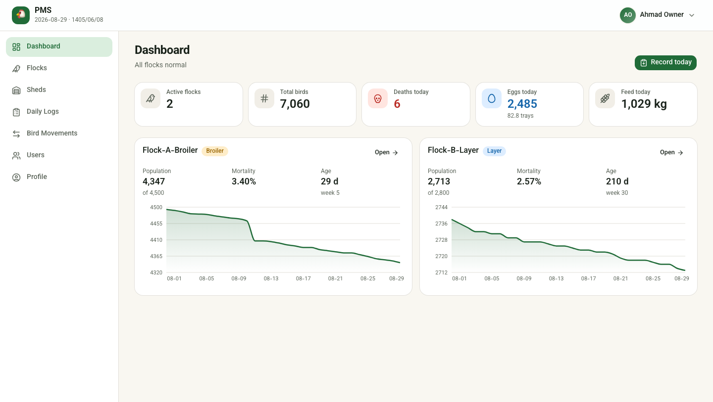 |

| Flock detail with charts | Sheds & occupancy |
|:--:|:--:|
| 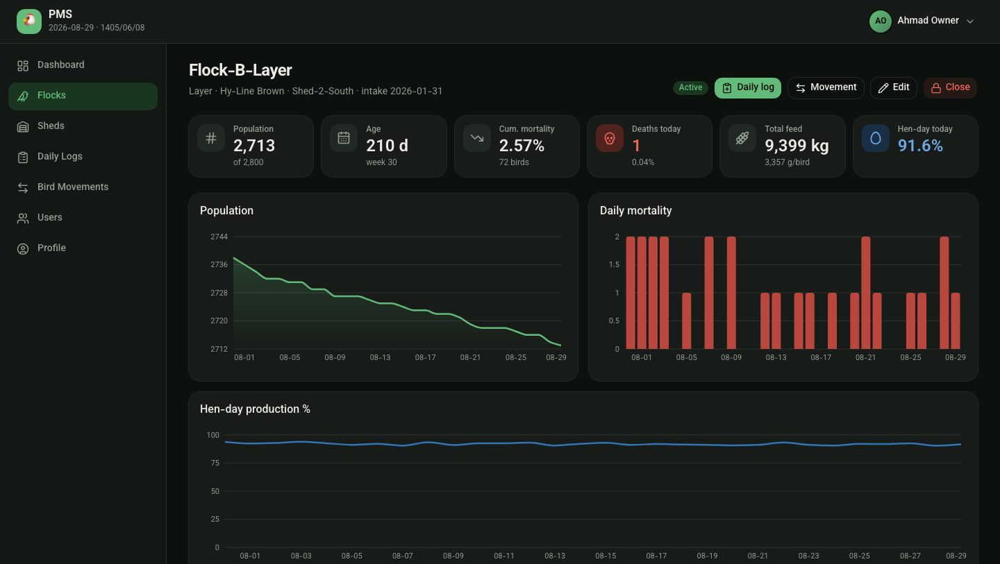 | 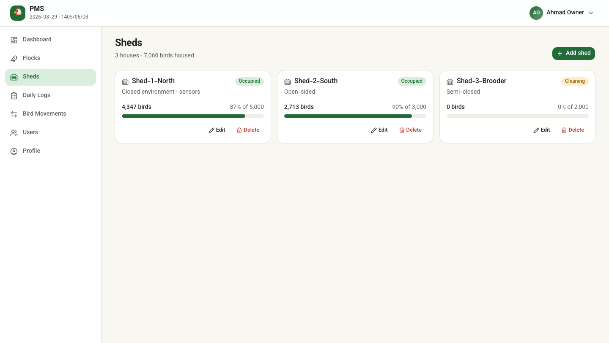 |

| Daily log dialog | Dari — full RTL |
|:--:|:--:|
| 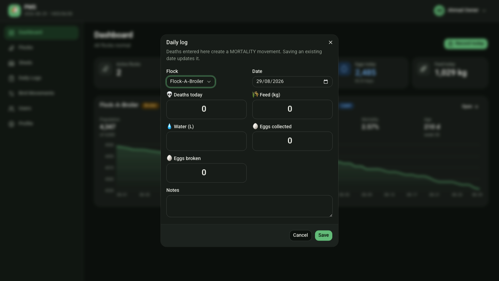 | 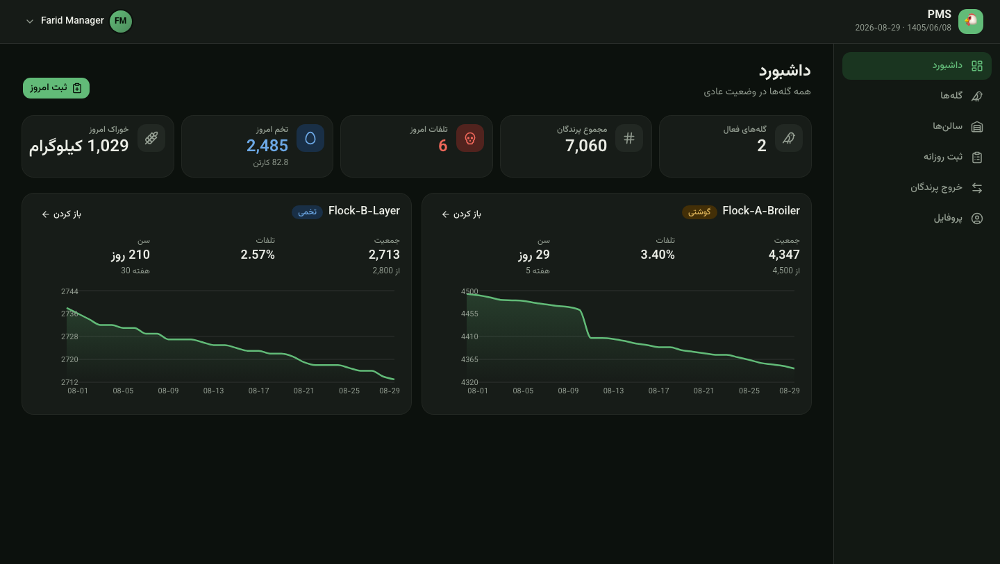 |

<table>
<tr>
<td align="center" width="60%"><b>Account menu</b><br/>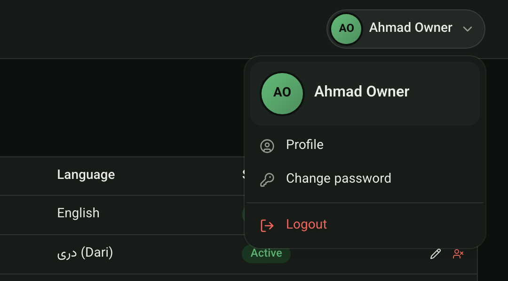</td>
<td align="center"><b>Mobile (Dari)</b><br/>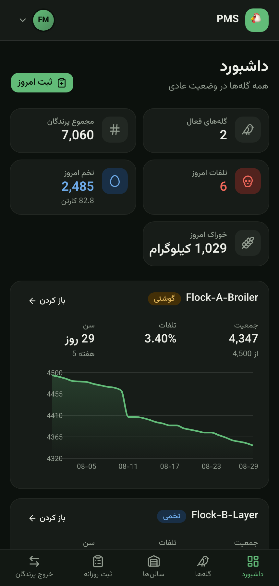</td>
</tr>
</table>

</div>

---

## 🏗 Architecture

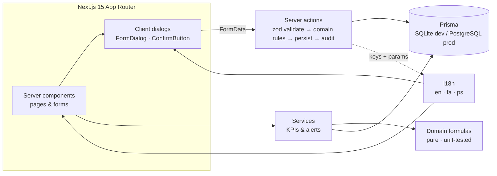

| Layer | Where | Notes |
|---|---|---|
| Domain formulas | `src/lib/domain/` | Pure functions, no DB — population, mortality, FCR, hen-day, alert rules |
| Services | `src/lib/services/` | Assemble KPIs and evaluate alerts against DB-stored thresholds |
| Server actions | `src/lib/actions.ts` | Every write: validate → business rules → persist → audit log. Returns `{ ok }` / `{ error }` |
| UI kit | `src/components/ui/` | shadcn/ui v4 (Base UI) primitives; `pms.tsx` for KPI tiles, badges, alerts |
| Dialogs | `src/components/forms/` | Create / edit dialogs per entity, reused everywhere |
| i18n | `src/lib/i18n/` | Typed dictionaries — a missing translation fails `tsc` |
| Schema | `prisma/schema.prisma` | All 13 entities from the spec + `settings`, `breed_standards`, `tasks` |

---

## 🧪 Testing

```bash
npm test
```

Formulas are verified against hand-calculated examples — population and mortality math, FCR, hen-day %, alert thresholds — plus i18n checks that every key exists in all three languages with matching placeholders.

---

## 🗺 Roadmap

Built phase by phase from [`SPEC.md`](SPEC.md); each phase is a shippable slice.

- [x] **Phase 1 — Core records:** users & roles, sheds, flocks, daily logs, bird movements, dashboard, alerts #3 & #13
- [x] **Localization:** English · Dari · Pashto, RTL, dual calendar
- [ ] **Phase 2 — Health:** vaccination program templates, health logs, vaccination alerts
- [ ] **Phase 3 — Finance & inventory:** transactions, suppliers/buyers on credit, feed and egg stock, low-stock alerts
- [ ] **Phase 4 — Analytics:** breed-standard curves, FCR drift, cost per kg / per egg, batch closure report
- [ ] **Phase 5 — Environment & polish:** temperature/humidity logs, heat & cold stress alerts, PDF/Excel export, offline sync
- [ ] **Phase 6 — AI assistant:** natural-language farm Q&A, anomaly narratives, voice data entry, weekly advisory report

---

## 🌐 Localization

All UI text lives in `src/lib/i18n/{en,fa,ps}.ts`. Adding a key to English without its Dari and Pashto counterparts fails the type-check, and tests assert placeholder parity. The interface language follows each user's profile; RTL, fonts and date formats switch automatically.

> The Dari and Pashto translations were machine-drafted. Please have a native speaker review farm terminology before production use.

---

## 🛠 Scripts

| Command | Purpose |
|---|---|
| `npm run dev` | Development server |
| `npm run build && npm start` | Production build & serve |
| `npm test` | Unit tests (vitest) |
| `npm run db:migrate` | Create a migration after editing `prisma/schema.prisma` |
| `npm run db:seed` | Re-seed demo data |
| `npm run db:reset` | Drop, migrate and seed |

**Switching to PostgreSQL:** set `provider = "postgresql"` in `prisma/schema.prisma`, point `DATABASE_URL` at your database, delete `prisma/migrations`, then `npm run db:migrate`.

---

<div align="center">

Made for farms that count every bird. 🐔

</div>
